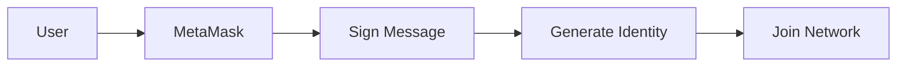
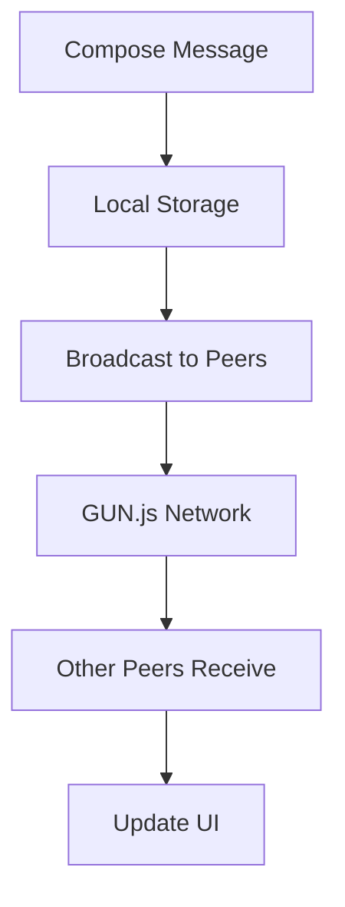

# NusaWhisper - Decentralized Room-Based Chat Application

<div align="center">


**Aplikasi chat terdesentralisasi berbasis Web3 dengan autentikasi wallet MetaMask dan sistem ruang chat**

[Demo Live](https://patradev-ai.github.io/NusaWhisper/) • [Dokumentasi](#dokumentasi) • [Kontribusi](#kontribusi)

</div>

## 📋 Daftar Isi

- [Tentang Proyek](#tentang-proyek)
- [Fitur Utama](#fitur-utama)
- [Teknologi yang Digunakan](#teknologi-yang-digunakan)
- [Cara Kerja](#cara-kerja)
- [Instalasi & Penggunaan](#instalasi--penggunaan)
- [Panduan Penggunaan](#panduan-penggunaan)
- [Arsitektur Sistem](#arsitektur-sistem)
- [Dokumentasi API](#dokumentasi-api)
- [Pengembangan](#pengembangan)
- [Changelog](#changelog)
- [Kontribusi](#kontribusi)
- [Lisensi](#lisensi)
- [Dukungan & Donasi](#dukungan--donasi)

## Tentang Proyek

DecentralChat adalah aplikasi chat terdesentralisasi yang menggabungkan teknologi blockchain dan peer-to-peer messaging. Aplikasi ini menggunakan MetaMask untuk autentikasi pengguna dan GUN.js untuk penyimpanan data terdesentralisasi serta messaging real-time, menciptakan pengalaman chat Web3-native tanpa bergantung pada server terpusat tradisional.

### Tujuan Proyek

- Memberikan platform komunikasi yang benar-benar terdesentralisasi
- Memastikan privasi dan keamanan pengguna melalui teknologi blockchain
- Menyediakan pengalaman chat yang responsif dan modern
- Mendemonstrasikan implementasi Web3 dalam aplikasi praktis

## Fitur Utama

### Sistem Ruang Chat

- **Buat Ruang**: Pengguna dapat membuat ruang chat publik atau privat
- **Gabung via Undangan**: Sistem kode undangan untuk ruang privat
- **Manajemen Ruang**: Keluar dari ruang, hapus chat, dan kontrol administrator
- **Undang Pengguna**: Undang pengguna lain menggunakan alamat Ethereum

### Messaging

- **Real-time**: Pesan tersinkronisasi secara real-time di seluruh peer
- **Direct Message**: Chat langsung antar pengguna
- **Riwayat Pesan**: Penyimpanan pesan persistent melalui jaringan P2P
- **Notifikasi Suara**: Notifikasi audio untuk pesan baru

### Manajemen Pengguna

- **Autentikasi Wallet**: Login menggunakan MetaMask
- **Status Online**: Kontrol visibilitas status online
- **Nickname**: Sistem nama panggilan yang dapat disesuaikan
- **Profil Pengguna**: Informasi pengguna dengan alamat Ethereum

### Antarmuka & UX

- **Responsive Design**: Mendukung desktop dan mobile
- **Dark/Light Mode**: Sistem tema yang dapat diubah
- **Sidebar Navigasi**: Navigasi terstruktur untuk ruang dan kontak

### Keamanan & Privasi

- **Enkripsi Wallet**: Autentikasi berbasis cryptographic signature
- **Decentralized Storage**: Data disimpan di jaringan P2P, bukan server terpusat
- **No Registration**: Tidak perlu registrasi tradisional
- **Anonymous**: Identitas berdasarkan alamat wallet

## Teknologi yang Digunakan

### Frontend

- **Vanilla JavaScript**: Arsitektur modular berbasis class
- **Tailwind CSS**: Framework CSS untuk styling responsif
- **Web3 Integration**: Integrasi dengan MetaMask dan Ethereum
- **Progressive Web App**: Dukungan PWA untuk pengalaman native

### Backend/Infrastruktur

- **GUN.js**: Database peer-to-peer untuk penyimpanan terdesentralisasi
- **MetaMask**: Autentikasi dan manajemen wallet
- **Github**: Platform hosting dan deployment

### Arsitektur Data

- **Peer-to-Peer**: Tidak ada server terpusat
- **Real-time Sync**: Sinkronisasi data real-time via GUN.js
- **Distributed Storage**: Penyimpanan terdistribusi di multiple peer
- **Cryptographic Identity**: Identitas berdasarkan alamat Ethereum

## Cara Kerja

### 1. Autentikasi



1. Pengguna menghubungkan wallet MetaMask
2. Sistem meminta signature untuk verifikasi kepemilikan wallet
3. Alamat Ethereum digunakan sebagai identitas unik
4. Pengguna bergabung ke jaringan P2P

### 2. Messaging Flow



## Instalasi & Penggunaan

### Prasyarat

- Browser modern dengan dukungan Web3
- MetaMask extension terinstall
- Koneksi internet untuk peer discovery

### Langkah Instalasi

1. **Clone Repository**

```bash
git clone https://github.com/patradev-ai/NusaWhisper.git
cd NusaWhisper
```

2. **Jalankan Server Development**

```bash
python3 -m http.server 5000
```

3. **Akses Aplikasi**

```
http://localhost:5000
```

## Panduan Penggunaan

### Memulai Chat

1. **Hubungkan Wallet**

   - Klik "Connect MetaMask"
   - Approve koneksi di MetaMask
   - Tunggu hingga autentikasi selesai

2. **Mulai Berkirim Pesan**
   - Tambahkan Kontak
   - Pilih list kontak dari sidebar
   - Ketik pesan di input box
   - Tekan Enter atau klik tombol Send

### Fitur Lanjutan

- **Direct Message**: Klik tab "Contacts" dan pilih "Start Direct Chat"
- **Pengaturan**: Klik avatar pengguna untuk akses pengaturan
- **Ganti Theme**: Klik icon bulan/matahari di header

## Arsitektur Sistem

### Struktur Proyek

```
decentralchat/
├── css/
│   └── styles.css          # Styling dan tema
├── js/
│   ├── app.js             # Controller utama aplikasi
│   ├── auth.js            # Modul autentikasi MetaMask
│   ├── chat.js            # Modul messaging
│   ├── ui.js              # Manajemen antarmuka pengguna
│   ├── utils.js           # Utility functions
├── index.html             # Entry point aplikasi
└── README.md              # Dokumentasi
```

### Komponen Utama

#### 1. Authentication Module (`js/auth.js`)

- Manajemen koneksi MetaMask
- Validasi dan formatting alamat
- Persistensi sesi pengguna
- Sistem nickname

#### 2. Chat Module (`js/chat.js`)

- Real-time messaging melalui GUN.js
- Direct messaging system
- Message queue dan rate limiting

#### 3. UI Module (`js/ui.js`)

- Theme switching (dark/light mode)
- Modal management
- Toast notifications
- Responsive layout handling

#### 4. App Controller (`js/app.js`)

- Inisialisasi dan koordinasi modul
- Event listener management
- Error handling global
- Application lifecycle

## Pengembangan

### Development Setup

1. **Environment Setup**

```bash
# Clone repository
git clone https://github.com/patradev-ai/NusaWhisper.git
cd NusaWhisper

# Install dependencies (if any)
# No npm dependencies required - pure vanilla JS

# Start development server
python3 -m http.server 5000
```

2. **Development Workflow**

- Refresh browser untuk melihat perubahan
- Test di multiple browser dan device
- Commit dan push perubahan

### Kontribusi

1. Fork repository
2. Buat branch fitur (`git checkout -b feature/AmazingFeature`)
3. Commit perubahan (`git commit -m 'Add some AmazingFeature'`)
4. Push ke branch (`git push origin feature/AmazingFeature`)
5. Buat Pull Request

### Testing

- Test manual di browser modern
- Verify MetaMask integration
- Test responsive design di multiple screen size
- Validate P2P connectivity

### Performance Optimization

- Lazy loading untuk message history
- Cleanup otomatis untuk data lama
- Rate limiting untuk mencegah spam

## Changelog

### v1.0.0 (July 4, 2025)

#### 🎉 Initial Release

- ✅ MetaMask authentication integration
- ✅ Responsive design (desktop & mobile)
- ✅ Dark/Light theme support
- ✅ Multi-language support (EN/ID)
- ✅ Direct messaging system
- ✅ Invite system with codes
- ✅ User presence tracking
- ✅ Real-time message synchronization

#### Technical Implementation

- ✅ GUN.js P2P database integration
- ✅ Modular JavaScript architecture
- ✅ CSS variables for theming
- ✅ Event-driven component communication
- ✅ Local storage for user preferences
- ✅ Automatic cleanup and optimization

#### Features Added

- **User Management**: Online status, nicknames, profiles
- **Messaging**: Real-time chat with message history
- **UI/UX**: Modern, responsive interface with accessibility
- **Security**: Wallet-based authentication and message signing

#### Bug Fixes

- Resolved online status persistence issues
- Corrected mobile sidebar navigation
- Fixed message duplicate prevention
- Improved error handling across modules

### Development History

- **July 4, 2025**: Project inception and initial development
- **July 4, 2025**: Core authentication and messaging system
- **July 4, 2025**: UI/UX implementation and responsive design
- **July 4, 2025**: Direct messaging and contact system
- **July 4, 2025**: Theme system and internationalization
- **July 4, 2025**: Testing, optimization, and bug fixes

- **July 5, 2025**: Fixing Dark & Light Theme
- **July 5, 2025**: Fixing Direct Messaging
- **July 5, 2025**: UI/UX Improvements

## Kontribusi

Kontribusi sangat diterima! Berikut cara untuk berkontribusi:

### Types of Contributions

- 🐛 **Bug Reports**: Laporkan bug yang ditemukan
- ✨ **Feature Requests**: Usulkan fitur baru
- 📝 **Documentation**: Perbaikan dokumentasi
- 🔧 **Code Contributions**: Perbaikan dan fitur baru

### Contribution Guidelines

1. Baca kode etik proyek
2. Check existing issues sebelum membuat yang baru
3. Gunakan conventional commit messages
4. Test perubahan secara menyeluruh
5. Update dokumentasi jika diperlukan

### Development Roadmap

- [ ] Mobile app dengan Capacitor
- [ ] Enhanced encryption untuk message
- [ ] Integration dengan ENS domains
- [ ] Custom peer discovery options

## Lisensi

Distributed under the MIT License. See `LICENSE` for more information.

## Dukungan & Donasi

Jika proyek ini bermanfaat untuk Anda, pertimbangkan untuk memberikan dukungan:

### Social Media

- **Instagram**: [@patradev.id](https://www.instagram.com/patradev.id/)

### Donasi

- **Crypto**: -
- **Trakteer**: https://trakteer.id/patradev
- **Saweria**: https://saweria.co/patradev
- **PayPal**: -

### ⭐ Star Repository

Jangan lupa untuk memberikan star pada repository ini jika Anda merasa terbantu!

---

<div align="center">

**Dibuat dengan ❤️ untuk komunitas Web3**

[⬆ Kembali ke atas](#nusawhisper---decentralized-room-based-chat-application)

</div>
